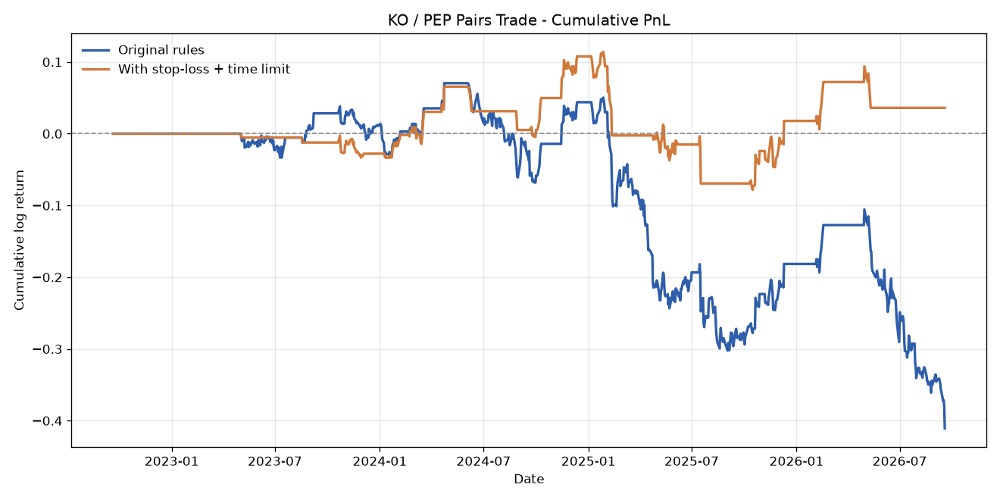

# Pairs Trading Backtest: KO / PEP

A mean-reversion statistical arbitrage backtest on Coca-Cola (KO) and PepsiCo (PEP),
built to test whether a classic textbook pairs trade actually holds up on real data.

**It doesn't - and the reason why is the point of the project.**

## Headline finding

The pair is **correlated but not cointegrated**.

Daily returns correlate at **0.635**, which is high for two individual equities and is
the statistic normally used to justify pair selection. But formal cointegration testing
rejects mean reversion at every horizon tested:

| Sample | Engle-Granger p | ADF p | Verdict |
|---|---|---|---|
| Full (2022-2026) | 0.505 | 0.993 | Not mean-reverting |
| First half | 0.992 | 0.942 | Not mean-reverting |
| Second half | 0.986 | 0.966 | Not mean-reverting |

Correlation measures whether two series move in the same direction day to day.
Cointegration measures whether the *gap* between them is tethered, so that a stretched
spread gets pulled back. A mean-reversion strategy depends entirely on the second
property. KO and PEP have the first and not the second: they wobble in sync while the
distance between them drifts freely.

Critically, the first half fails the test too. So this is not a story about a pair that
worked and then broke - the spread was never anchored. The apparently reasonable
performance through 2023-24 was an unanchored series wandering back toward its starting
point by chance; 2025-26 was the same series wandering away and not returning.

## Results

Four years of daily closes, Sept 2022 - Sept 2026, 1,004 trading days.

| | Baseline | With risk controls |
|---|---|---|
| Entry / exit | z-score ±2 / 0 | same, plus stop at abs(z)=3, 30-day max hold |
| Trades | 12 | 17 |
| Win rate | 7/12 | 8/17 |
| Avg holding period | 41 days | 13 days |
| Days in position | 593 / 1004 | 221 / 1004 |
| Cumulative return | **-33.7%** | **+3.7%** |
| Sharpe | **-0.81** | **0.11** |



Risk controls turn a large loss into approximately nothing. A Sharpe of 0.11 is
indistinguishable from zero: stop-losses limit what a broken assumption costs you, they
do not make the assumption true.

One honest caveat on that +3.7%: after its final stop-loss in May 2026 the risk-managed
variant stops trading entirely for the last four months of the sample - precisely the
window in which the baseline loses most of its remaining value. A meaningful share of
that outperformance is non-participation rather than skill.

## Method

1. **Data** - daily closes for both tickers via `yfinance`, converted to log prices so
   percentage moves are comparable across two stocks at very different price levels.
2. **Spread** - `log(KO) - log(PEP)`, an equal-dollar spread. A regression-fitted hedge
   ratio was tried first and rejected: it returned an implausible -0.594 because an OLS
   fit on non-stationary price levels picks up each stock's own trend rather than their
   co-movement. A rolling regression made it noisier, not better. Return-correlation
   testing confirmed the problem was the estimator, not the pair.
3. **Signal** - rolling 60-day z-score of the spread, so the baseline adapts as the
   relationship drifts.
4. **Rules** - enter at z-score ±2, exit on reversion to 0, implemented as an explicit
   day-by-day state machine.
5. **Returns** - yesterday's position times today's change in spread. The one-day lag
   matters: a threshold crossing is only observable at the close, so a same-day
   attribution would be lookahead bias.
6. **Testing** - Engle-Granger and ADF, run full-sample and split-sample; plus a
   risk-managed variant to test whether stop-losses could rescue the result.

## Running it

```bash
pip install -r requirements.txt
python pairs_trading.py
```

The script pulls fresh data up to today's date, so results will drift from those quoted
above as the sample extends.

## Limitations

No transaction costs, slippage, or short borrow costs. With 17 trades and a roughly
breakeven gross result, realistic costs would make the risk-managed variant clearly
negative. Parameters (±2 threshold, 60-day window) were set a priori and not validated
out of sample. One pair over one period, so nothing here generalises to the strategy
class. And the market-neutrality assumption would break in a crisis, when cross-equity
correlations converge toward 1.

## What I would do next

Screen for cointegration *before* trading a pair rather than after. Test across a
universe of candidate pairs rather than one. Model transaction costs. Check parameter
stability rather than fixing thresholds by convention. Consider a dynamic hedge ratio
via a Kalman filter instead of a static assumption.
